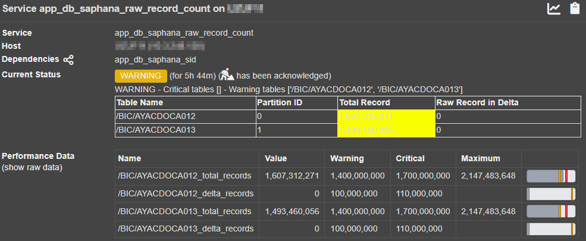

# SAP HANA Nagios plugin

Nagios plugin to monitor SAP HANA database




```bash
Help :
.\check_saphana_health.py --help
usage: check_saphana_health.py [-h] --hostname HOSTNAME --username USERNAME --password PASSWORD --sqlport SQLPORT [--mode MODE] [--warning WARNING]
                             [--critical CRITICAL] [--timeout TIMEOUT]

Check SAP HANA database
          backup : last backup

options:
-h, --help           show this help message and exit

required named arguments:
--hostname HOSTNAME  SAP HANA hostname
--username USERNAME  SAP HANA login
--password PASSWORD  SAP HANA password
--sqlport SQLPORT    SAP HANA SQL port
--mode MODE          backup_data, backup_log , version, cpu, memory, mem_host, services, services_all, license_usage, db_data, db_log, db_trace, alert, sid,
                     log_usage, raw_record_count
--warning WARNING    Warning threshold for modes supporting it.
--critical CRITICAL  Critical threshold for modes supporting it.
--timeout TIMEOUT    increase the default (60s) timeout

Examples :
check_saphana_health.py --hostname=XXX --username=XXX --password='"SAP HANA PW"' --sqlport=30015 --mode=alert --warning=3 --critical=4
check_saphana_health.py --hostname=XXX --username=XXX --password='"SAP HANA PW"' --sqlport=30015 --mode=backup_data --warning= --critical=2
check_saphana_health.py --hostname=XXX --username=XXX --password='"SAP HANA PW"' --sqlport=30015 --mode=backup_log --warning= --critical=3
check_saphana_health.py --hostname=XXX --username=XXX --password='"SAP HANA PW"' --sqlport=30015 --mode=cpu
check_saphana_health.py --hostname=XXX --username=XXX --password='"SAP HANA PW"' --sqlport=30015 --mode=log_usage
check_saphana_health.py --hostname=XXX --username=XXX --password='"SAP HANA PW"' --sqlport=30015 --mode=memory --warning=80 --critical=90
check_saphana_health.py --hostname=XXX --username=XXX --password='"SAP HANA PW"' --sqlport=30015 --mode=raw_record_count --warning=1.4e9:100e6 --critical=1.7e9:110e6
check_saphana_health.py --hostname=XXX --username=XXX --password='"SAP HANA PW"' --sqlport=30015 --mode=services_all
check_saphana_health.py --hostname=XXX --username=XXX --password='"SAP HANA PW"' --sqlport=30015 --mode=sid
```

=> see PREREQUISITES.TXT

Initial author : Rodolphe ALT  
website : https://www.altr-consulting.com  
French SAP Consultant  
